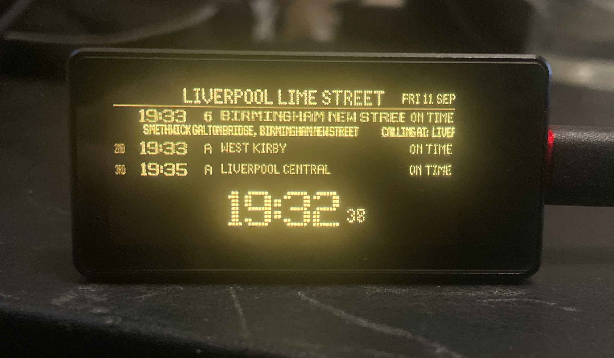

# Signalboarder device

A small UK train departure board for the Waveshare ESP32-S3-AMOLED-1.91.
Three trains, the first train's calling points and a clock, in amber on a
536 × 240 screen.

This is the firmware. The [browser board and server](https://github.com/alcun/signalboarder)
live in a separate repository.

## Flash a board

You need:

- [Waveshare ESP32-S3 1.91" AMOLED board](https://thepihut.com/products/esp32-s3-1-91-amoled-display-development-board-240-x-536?variant=53675266998657),
  with ESP32-S3R8, 16 MB flash and 8 MB PSRAM. Choose a **touch** variant for
  on-screen station selection.
- A USB-C data cable.
- A Mac or Linux computer.

This is the only board the firmware has been tested on. The non-touch path
has not been hardware-tested.

```sh
git clone https://github.com/alcun/signalboarder-device.git
cd signalboarder-device
./flash
```

The script finds PlatformIO, or attempts to install it using Homebrew, pipx or
pip. If installation fails, install [PlatformIO](https://platformio.org/install/cli)
and run the script again. Linux users may also need its
[USB permissions setup](https://docs.platformio.org/en/latest/core/installation/udev-rules.html).

Press Enter to use `https://signalboarder.alcun.dev`, or enter your own server's
HTTPS origin. The script lists connected devices and asks before replacing the
firmware. Connect only the board you intend to flash. The first build downloads
the toolchain and libraries, so allow several minutes and an internet connection.

On first boot, join the board's `SIGNALBOARDER-SETUP` Wi-Fi network and follow
the setup page to connect it to your Wi-Fi. Press RESET if the display stays
blank after flashing.

## Choose a station

- **On the display:** hold the station name for about a second, then use the
  three letter columns to choose its code.
- **From your phone or computer:** open [signalboarder.local](http://signalboarder.local)
  on the same network and search by name. If that address does not resolve,
  use the board's IP address.
- **In the setup portal:** hold BOOT for about a second, then join
  `SIGNALBOARDER-SETUP`. The portal also opens when the board cannot join Wi-Fi.

The station list and setup page are stored on the device, so station selection
works without internet access. Live departures still need Wi-Fi and a reachable
Signalboarder server. Settings are saved between restarts.

## Use your own server

The device fetches JSON from a Signalboarder server. National Rail credentials
stay on that server; the firmware does not need a provider key.

Follow the server's [self-hosting guide](https://github.com/alcun/signalboarder/blob/main/SELFHOSTING.md),
then enter its HTTPS address during flashing or on the device's local page.
That page allows anyone on your local network to change the board's settings,
so use a network you trust.

## Build and test

To compile without uploading, with PlatformIO installed:

```sh
pio run
```

A direct build has no server address baked in. Set `SIGNALBOARDER_API_URL`
when building to provide one, or configure it through the setup portal.
`./flash` supplies this value from its prompt.

The parser and station tests run on a computer without a board. After
`pio run` has installed ArduinoJson:

```sh
g++ -std=c++17 -I src -I .pio/libdeps/signalboarder/ArduinoJson/src \
  src/departures.cpp test/test_departures.cpp -o /tmp/signalboarder-departures
/tmp/signalboarder-departures

g++ -std=c++17 -I src src/stations.cpp test/test_stations.cpp \
  -o /tmp/signalboarder-stations
/tmp/signalboarder-stations
```

[DESIGN.md](DESIGN.md) covers the hardware, configuration and API contract. The layout and pin map are specific to this board;
other displays need code changes. [CHANGELOG.md](CHANGELOG.md) records updates.

## Licence and credits

The firmware is [MIT licensed](LICENSE). Daniel Hart's Dot Matrix typeface is
under the SIL Open Font License; the station list from Dav Wheat and Trainline
EU is under the Open Database License. Dependencies retain their own licences.
See [THIRD_PARTY_NOTICES.md](THIRD_PARTY_NOTICES.md) for details.
